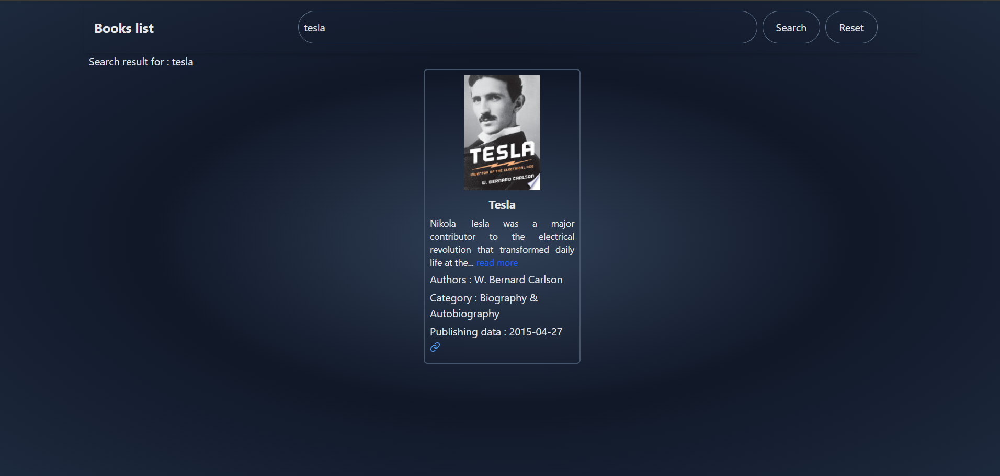

# 📚 Books listing App

A React-based web application that allows users to search for books using a free public API. Users can search by title or author, view book details, and reset the search to display all available books. The app also includes error handling, loading states, and custom hooks for book-related functions. 

## 🚀 Live Demo & Repository

- **Live App:** [Book Finder App](https://books-listing-assignment.web.app)
- **GitHub Repository:** [GitHub Link](https://github.com/abhishek-2k23/book-list)

## 📑 Table of Contents

- [Features](#features)
- [Screenshots](#screenshots)
- [Tech Stack](#tech-stack)
- [Installation](#installation)
- [Usage](#usage)
- [License](#license)

## ✨ Features

- 🔍 **Search Books** - Search by title or author.
- 🎨 **Book Listing** - Display book image, title, author, category, and description.
- 🔄 **Reset Search** - Clear input and show all books again.
- 🔥 **React Hot Toast** - Show notifications.
- 📖 **Detailed View** - Click "Read More" to view full details of a book.
- 🚀 **Optimized Performance** - Uses `useContext` for state management.
- 🛠️ **Error Handling & Loading States** - Ensures smooth user experience.

## 📸 Screenshots

| Home Page |  Book Details |
|-----------|-------------|
|  |  |

| Loading Page |  Search Details |
|-----------|-------------|
|  |   |

## 🛠️ Tech Stack & Packages

- **Framework:** [Vite](https://vitejs.dev/) (for React)
- **State Management:** React Context API (`ApiContext`)
- **UI & Icons:** [React Icons](https://react-icons.github.io/react-icons/)
- **Notifications:** [React Hot Toast](https://react-hot-toast.com/)
- **Hosting:** Firebase

## 📥 Installation

```bash
# Clone the repository
git clone https://github.com/abhishek-2k23/book-list

# Navigate to the project folder
cd book-list

# Install dependencies
npm install

# Start the development server
npm run dev
```

## 🚀 Usage

1. Open the app in your browser.
2. Enter a book title or author name in the search bar.
3. Click the **Search** button to fetch books.
4. Click **Reset** to clear the input and display all books.
5. Click **Read More** on any book to see detailed information.
